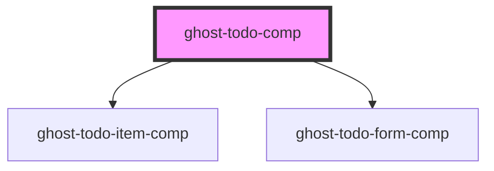

# ghost-todo-comp

<!-- Auto Generated Below -->

## Properties

| Property    | Attribute    | Description | Type     | Default     |
| ----------- | ------------ | ----------- | -------- | ----------- |
| `initTodos` | `init-todos` |             | `string` | `undefined` |

## Events

| Event        | Description | Type                      |
| ------------ | ----------- | ------------------------- |
| `todoChange` |             | `CustomEvent<TodoItem[]>` |

## Dependencies

### Depends on

- [ghost-todo-item-comp](../ghost-todo-item-comp)
- [ghost-todo-form-comp](../ghost-todo-form-comp)

### Graph

----------------------------------------------

*Built with [StencilJS](https://stenciljs.com/)*
