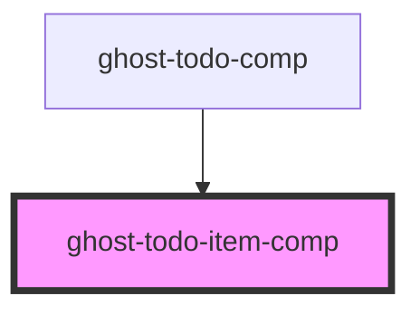

# ghost-todo-item-comp

<!-- Auto Generated Below -->

## Properties

| Property | Attribute | Description | Type     | Default     |
| -------- | --------- | ----------- | -------- | ----------- |
| `item`   | `item`    |             | `string` | `undefined` |

## Events

| Event                 | Description | Type                    |
| --------------------- | ----------- | ----------------------- |
| `changeTodoCompleted` |             | `CustomEvent<TodoItem>` |
| `clickTodoRemove`     |             | `CustomEvent<TodoItem>` |

## Dependencies

### Used by

 - [ghost-todo-comp](../ghost-todo-comp)

### Graph

----------------------------------------------

*Built with [StencilJS](https://stenciljs.com/)*
